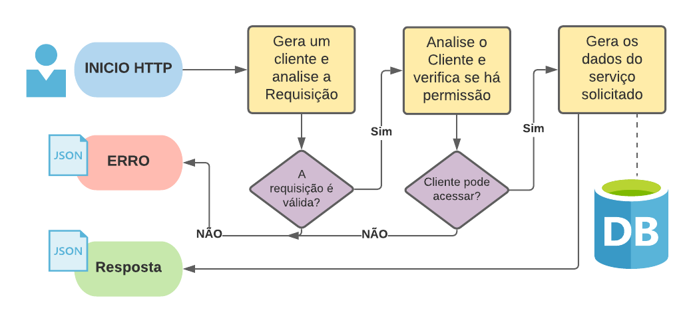

# Hunter API

REST API do Hunter

***Fluxograma***



# Uso

***REQUEST***

HEADER

```X-KEY-MACHINE:{machine}```

URL

```{url_base}/{object}/{function}/{client.slug}```

***POST***

Qualquer requisição com necessita de envio variáveis devem ser realizadas via metodo POST

## ****Em javascript****

Com uso da biblioteca [axios](https://www.npmjs.com/package/axios)

### exemplo:

```javascript
axios.post(URL, vars, {
    headers: {
        'X-KEY-MACHINE': machine
    }
})
.then((response) => {
    // .. TODO ..
})
.catch((error) => {
    // .. TODO ..
})
```

## ****Em PHP****
Com uso da biblioteca cURL

### exemplo:

```php
$ch = curl_init();
curl_setopt($ch, CURLOPT_URL, URL);
curl_setopt($ch, CURLOPT_POST, true);
curl_setopt($ch, CURLOPT_POSTFIELDS, $vars);
curl_setopt($ch, CURLOPT_RETURNTRANSFER, true);
curl_setopt( 
    $ch, 
    CURLOPT_HTTPHEADER,
    ['X-KEY-MACHINE:'.$machine]
);

$response = curl_exec($ch);
curl_close ($ch);
```

# Requisições Parametrizadas

A API funciona como uma espécie de ORM. Todos os dados que a aplicação precisar devem ser parametrizados.

*Exemplo em PHP:*

```php
define('URL', 'http://api.com.br/user/get/my_slug');
$vars = [
    'where' => [
        'id', '=', 1
    ]
];
curl_setopt($ch, CURLOPT_URL, URL);
curl_setopt($ch, CURLOPT_POSTFIELDS, $vars);
```

*Exemplo em JS:*

```javascript
const URL = 'http://api.com.br/user/get/my_slug';
let vars = {
    where:[
        'id', '=', 1
    ]
};
axios.post(URL, vars, headers);
```

